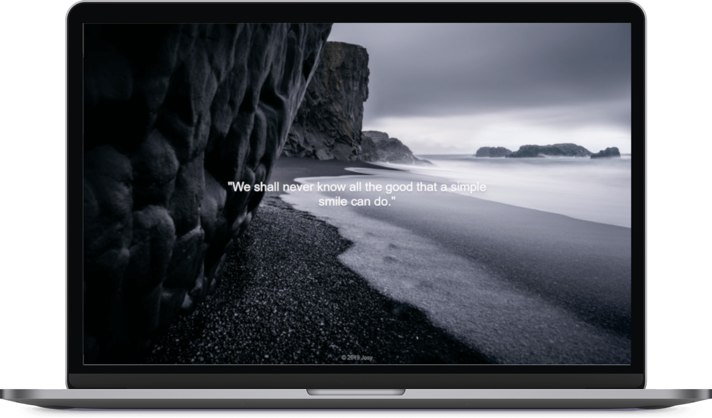

# Quote Generator

## Overview

This app shows you inspirational quotes with dreamy background images.
It is part of the [FreeCodeCamp Front End Libraries Certification](https://learn.freecodecamp.org/front-end-libraries/front-end-libraries-projects/build-a-random-quote-machine).

See the project in action [here](https://jh1408.github.io/Quote-Generator/).

## Features

- Load quotes using the [Quotable API](https://github.com/lukePeavey/quotable)
- Share quotes on Twitter
- Load background images using [Unsplash Source](https://source.unsplash.com/)

## Run the project

It's as easy as this:
- Clone the project
- Open the index.html file in your browser

## Tech stack
- HTML
- CSS
- jQuery

